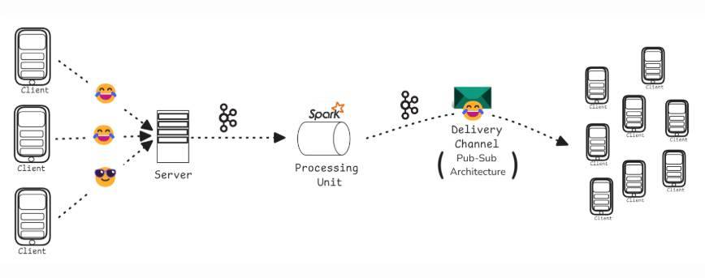
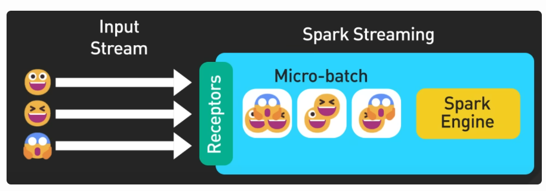
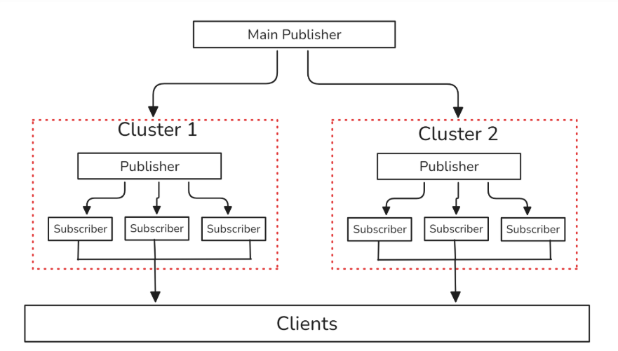
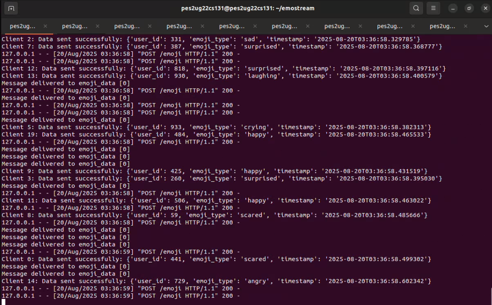
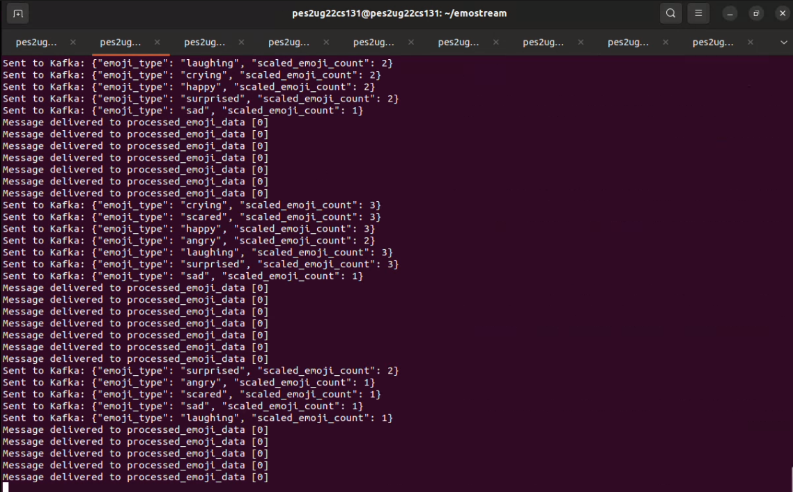
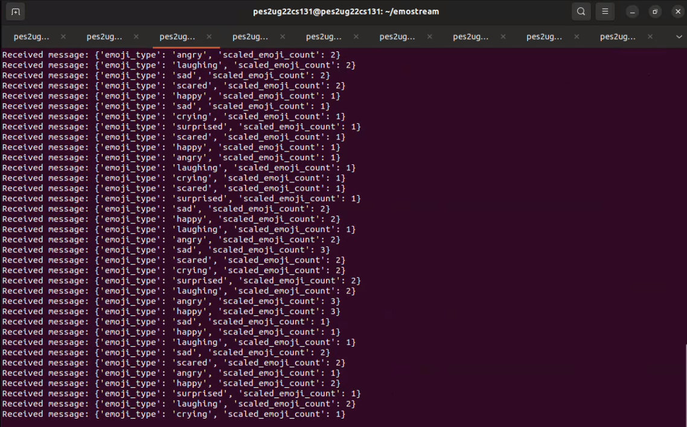
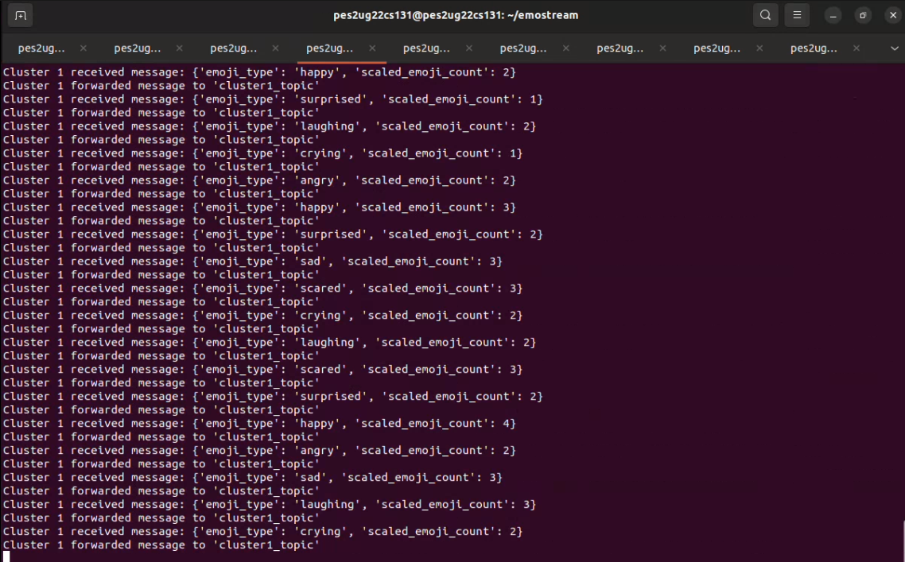
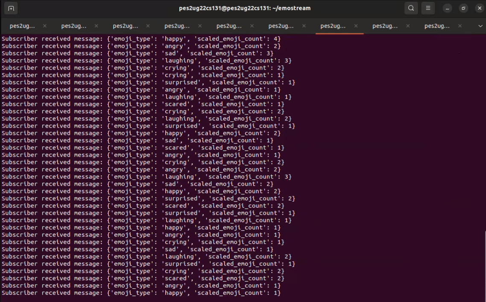

# EmoStream: Concurrent Emoji Broadcast over Event-Driven Architecture

## Project Overview
Emojis reflect the dynamic sentiments of fans in real-time. Capturing these user-generated signals as they flow in, distilling them into an emoji swarm that mirrors the crowd’s mood, and displaying these shifting emotions live is a major challenge—especially with billions of emoji reactions anticipated over the tournament.

---

## Application Architecture



### 1. Handling Client Requests (Data Ingestion)
- **API Endpoint (Flask/Express.js)**: Users send emoji data via POST requests (User ID, Emoji type, Timestamp).
- **Kafka Producer**: Buffers and flushes emoji data to Kafka every 500ms.

### 2. Real-Time Processing
- **Apache Spark Streaming**: Consumes emoji data stream from Kafka.
- **Micro-batching (2s interval)**: Aggregates emoji counts in near real-time.
- **Aggregation Algorithm**: 1000+ identical emojis → compressed into a single swarm.
 


### 3. Broadcasting to Clients
- **Main Publisher**: Entry point for publishing processed emoji data.
- **Cluster Publishers**: Receive data from main publisher and distribute to subscribers.
- **Subscribers**: Deliver real-time emoji updates directly to clients.

  

---

## Tech Stack
- **Backend API**: Flask 
- **Streaming**: Apache Kafka  
- **Processing**: Apache Spark Streaming  
- **Messaging**: Kafka

---

## Features
- Handles **1000's of concurrent emoji events**.  
- Ultra-low latency **(< 2s end-to-end)**.  
- Fault-tolerant and horizontally scalable.    
- Real-time broadcasting with Pub-Sub delivery.  

---

## Getting Started

### 1. Prerequisites
- Python 3.8+  
- Apache Kafka  
- Apache Spark  
- Docker (optional)  

### 2. Clone Repository
```bash
git clone https://github.com/your-username/emostream.git
cd emostream
```

### 3. Start Zookeeper & Kafka
```bash
# Start Zookeeper
bin/zookeeper-server-start.sh config/zookeeper.properties

# Start Kafka Broker
bin/kafka-server-start.sh config/server.properties
```

### 4. Run API (Flask Example)
```bash
python app.py
```

### 5. Run Spark Streaming Job
```bash
spark-submit spark_streaming.py
```

### 6. Run Main Publisher
```bash
python main_pub.py
```

### 7. Run Cluster Publisher & Subscribers
```bash
python cluster_pub.py
python cluster_sub.py
```

---

## Demo (Screenshots)
- API Producer:   
- Spark Streaming:   
- Main Publisher:   
- Cluster Publisher:   
- Cluster Subscriber:   

---
